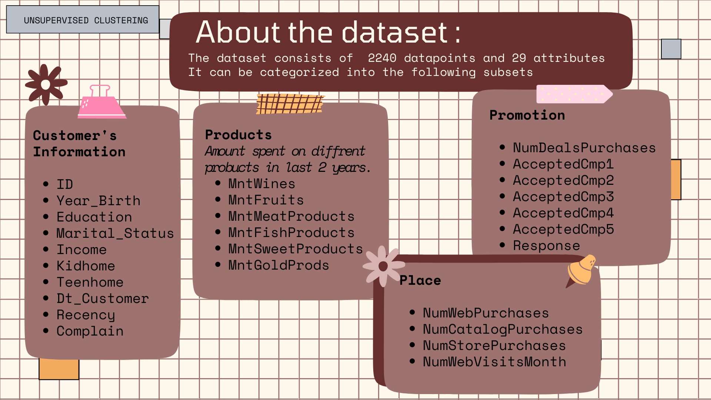

# CUSTOMER SEGMENTATION USING CLUSTERING

## INTRODUCTION

This project involves performing unsupervised clustering on customer records from a grocery firm's database. Customer segmentation is the practice of separating customers into groups that reflect similarities among customers in each cluster. The goal is to divide customers into segments to optimize the significance of each customer to the business, modify products according to distinct needs and behaviors of the customers, and cater to the concerns of different types of customers.

## INSTRUCTIONS

1. Use Copilot Chat to create a new notebook in your project. Use the command /newnotebook and name it "Customer Segmentation Clustering".
2. Use Copilot and Copilot Chat to develop the exercise and support your learning.

## EXERCISE

The objective of this project is to build a clustering model based on Scikit-learn and Python. The model should be able to segment customers into different clusters based on their purchasing behavior and other attributes.

### 1. Importing Required Libraries

Generate Python code to import necessary libraries for customer segmentation and clustering, including numpy, pandas, datetime, matplotlib, seaborn, sklearn, yellowbrick, and set a random seed. Also, suppress warnings if not already suppressed.

### 2. Loading the Dataset

2.1. Write Python code to load a dataset from a CSV file named "marketing_campaign.csv" with tab-separated values. Print the length of datapoints and display the first few rows of the dataset.
2.2. Write Python code to display information about the features of a dataset stored in the dataframe

### 3. Data Cleaning

3.1. Display the first 5 rows of the dataframe.  
3.2. Display the number of rows and columns in the dataframe.  
3.3. Display the data types of each column.  
3.4. Display the number of missing values in each column.  
3.5. Drop rows with missing values.  

### 4. Data Preprocessing & Feature Engineering

4.1. Create a feature indicating the number of days the customers have been registered in the firm's database.  
4.2. Create a feature ("Customer_For") of the number of days the customers started to shop in the store relative to the last recorded date
4.3. Explore the unique values in the categorical features to get a clear idea of the data.  
4.4. Extract the age of a customer by the birth year.  
4.5. Create a feature indicating the total amount spent by the customer in various categories over the span of two years.  
4.6. Create features to indicate the living situation, number of children, family size, and parenthood status.  
4.7. Label encode the categorical features.  
4.8. Scale the features using the standard scaler.  

### 5. Dimensionality Reduction

5.1. Create a subset dataframe for dimensionality reduction.  
5.2. Perform PCA to reduce the dimensions to 3.  
5.3. Plot the reduced dataframe.  

### 6. Clustering

6.1. Use KMeans to cluster the data.  
6.2. Determine the optimal number of clusters using the elbow method.  
6.3. Fit the model to the data and predict the clusters.  

### 7. Evaluating Models

7.1. Study the patterns in the clusters formed.  
7.2. Perform exploratory data analysis to draw conclusions about the clusters.  

### 8. Profiling

8.1. Profile the clusters to determine the nature of the customers in each cluster.  
8.2. Plot features indicative of the customer's personal traits in light of the cluster they are in.  

### 9. Conclusion
